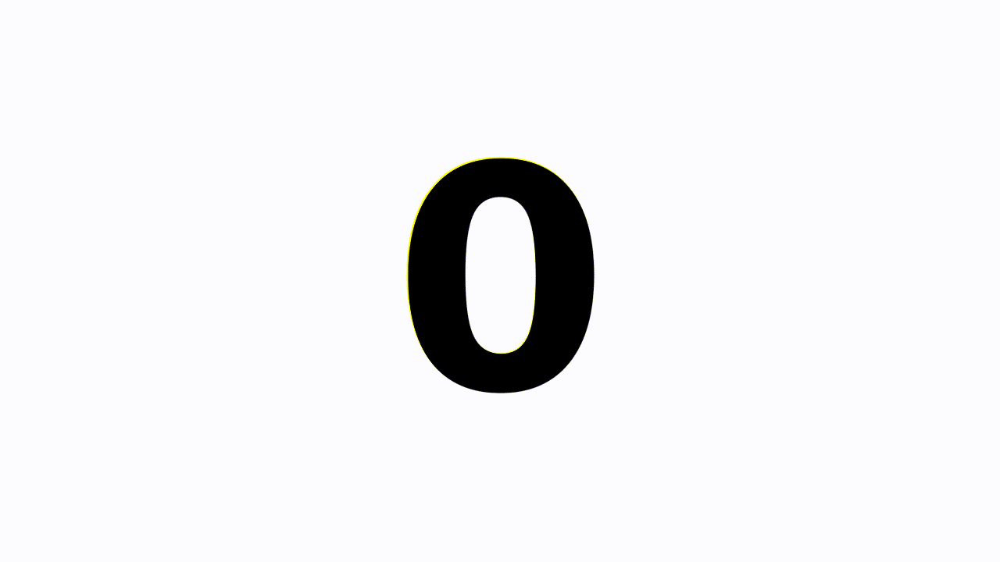

# Test various approaches to make a crossfaded slideshow from images

It generates images with numbers and makes a slideshow, showing each image for a configurable duration then crossfade into the next.

It generates a result like this:



## Approach #1: ffmpeg with fade and overlay filters

Based on [this method](https://superuser.com/a/834035).

Example:

```
ffmpeg -y -loop 1 -t 32.5 -i /tmp/NQNMpj/0.png -loop 1 -t 32.5 -i /tmp/NQNMpj/1.png -loop 1 -t 32.5 -i /tmp/NQNMpj/2.png -filter_complex [1]fade=d=0.5:t=in:alpha=1,setpts=PTS-STARTPTS+32/TB[f0]; [2]fade=d=0.5:t=in:alpha=1,setpts=PTS-STARTPTS+64/TB[f1]; [0][f0]overlay[bg1];[bg1][f1]overlay,format=yuv420p[v] -map [v] -movflags +faststart /tmp/output/res.mp4
```

## Approach #2: ffmpeg with xfade

Based on [this comment](https://www.reddit.com/r/ffmpeg/comments/f051j2/trying_to_make_video_from_images_with_crossfade/fguco1a/).

Example:

```
ffmpeg -y -loop 1 -t 32.5 -i /tmp/Ilb2mg/0.png -loop 1 -t 32.5 -i /tmp/Ilb2mg/1.png -loop 1 -t 32.5 -i /tmp/Ilb2mg/2.png -filter_complex [0][1]xfade=transition=fade:duration=0.5:offset=32[f1];[f1][2]xfade=transition=fade:duration=0.5:offset=64,format=yuv420p[v] -map [v] -movflags +faststart -r 25 /tmp/output/res.mp4
```

## Approach #3: melt

Uses the MLT framework to render the video.

Example:

```
melt /tmp/DdV4ig/0.png out=824 /tmp/DdV4ig/1.png out=824 -mix 12 -mixer luma /tmp/DdV4ig/2.png out=812 -mix 12 -mixer luma -consumer avformat:/tmp/output/res.mp4 frame_rate_num=25 width=1920 height=1080 sample_aspect_num=1 sample_aspect_den=1
```

## Usage

* Make sure you have Docker installed
* ```npm ci```
* ```npm run run -- --images 3 --imageDuration 2 --filename res.mp4 --algo 1```

### Options

* ```--images```: how many images are in the slideshow
* ```--imageDuration```: How long each image is shown
* ```--filename```: the name of the file that will be placed to the output directory
* ```--algo```: the approach to use (see above) [1, 2, 3]
